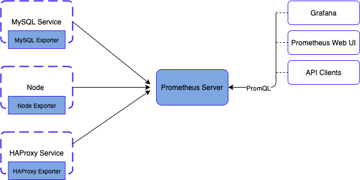
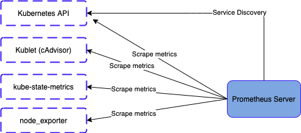

# Monitoring on EKS
Monitoring Lab:
Prometheus, Grafana and Loki implementation

## Prerequisites
EKS cluster to work on

## Introduction to Prometheus

### Overview
Prometheus is an open-source systems monitoring and alerting toolkit

### Components
The Prometheus ecosystem consists of multiple components, many of which are optional:

* prometheus server which scrapes and stores time series data
* client libraries for instrumenting application code
* push gateway for supporting short-lived jobs
* exporters for services like HAProxy, StatsD, Graphite, etc.
* alertmanager to handle alerts
* various support tools

### Client Libraries
Before you can monitor your services, you need to add instrumentation to their code via one of the Prometheus client libraries. These implement the Prometheus metric types.
This lets you define and expose internal metrics via an HTTP endpoint on your application’s instance:
* Go
* Java or Scala
* Python
* Ruby
There are other third party libraries.

## Exporters
We use exporters to instrument applications we don’t have the source code for
For that we install exporters next to the applications we want to collect data from, usually on the host server if possible.  

  

The exporter receive a data request from prometheus, it gathers and formats the data and send it back to Prometheus

The **node exporter** gets metrics from kubernetes clusters.  

## Service Discovery
Once we have exporters and API endpoints for prometheus there are two ways we can define them as targets for scraping:  
- Define them in prometheus configuration  
- Use service discovery  

We are gonna use service discovery to inform us when we have new pods and services in our cluster and those will show up as targets within prometheus.  
To monitor kubernetes we need to access the kubernetes API and other endpoints.  

  

## Step-by-step guide

We will setup a target within prometheus, so prometheus will go and scrape that target.  

1 - 

